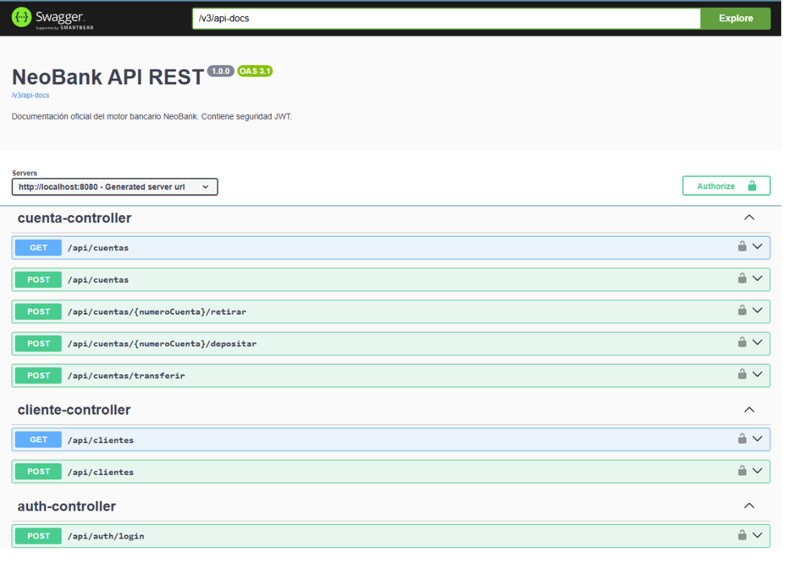

# 🏦 NeoBank API REST - Motor Bancario Transaccional


NeoBank es una API RESTful de grado de producción diseñada para simular el núcleo transaccional (Core Banking) de una institución financiera. Construida con los estándares modernos de la industria, esta API garantiza la integridad de los datos, seguridad sin estado (Stateless) y facilidad de despliegue.

## ✨ Características Principales

* **Transaccionalidad ACID:** Uso estricto de `@Transactional` para garantizar que las operaciones financieras (como transferencias) sean atómicas. O se completa toda la operación, o se revierte (Rollback) sin pérdida de dinero.
* **Seguridad Avanzada:** Implementación de Spring Security con **JSON Web Tokens (JWT)**. Control de acceso mediante filtros de autenticación y autorización (`Filter Chain`).
* **Diseño Orientado al Dominio:** Uso de herencia en base de datos (`SINGLE_TABLE`) para manejar distintos tipos de cuentas (Caja de Ahorro, Cuenta Corriente) con lógicas de negocio independientes (ej. límites de sobregiro).
* **Manejo de Errores Global:** Implementación de `@RestControllerAdvice` para capturar excepciones de negocio y validación (`@Valid`), devolviendo respuestas JSON estandarizadas y limpias (Códigos 400, 403, 409).
* **Contenerización:** Entorno completamente dockerizado usando `Dockerfile` multi-etapa y `docker-compose` para levantar la API y la base de datos con un solo comando.
* **Documentación Interactiva:** Integración con Swagger/OpenAPI 3.0 para pruebas directas desde el navegador.
* **Arquitectura Orientada a Eventos (EDA):** Integración con **Apache Kafka** para el procesamiento asincrónico.
* **Productor:** Emite eventos inmutables (`TransferenciaEvent`) al concretar operaciones financieras.
* **Consumidor:** Escucha tópicos específicos para reaccionar a los eventos en segundo plano (ej. notificaciones), logrando un desacoplamiento total y alta resiliencia.

## 🏗️ Arquitectura y Patrones

El proyecto sigue una arquitectura de 3 capas (Controller, Service, Repository) promoviendo la separación de responsabilidades y el Clean Code.

* **Patrón DTO:** Transferencia de datos segura entre la capa web y la capa de negocio usando Java Records.
* **Inyección de Dependencias:** Gestión eficiente de componentes mediante el contenedor de Inversión de Control (IoC) de Spring.

## 🚀 Instalación y Despliegue Rápido (Docker)

No es necesario tener Java o MySQL instalados localmente. Solo necesitas [Docker Desktop](https://www.docker.com/products/docker-desktop/).

1. Clonar el repositorio:
   ```bash
   git clone [https://github.com/FrancoBarbuio/neobank-api-rest.git](https://github.com/FrancoBarbuio/neobank-api-rest.git)
   cd neobank-api-rest
2. Levantar la infraestructura completa:
   ```bash 
   docker compose up --build -d
3. Acceder a la documentación interactiva:
   http://localhost:8080/swagger-ui/index.html 



## 👨‍💻 Autor

**Franco Barbuio**
* Rol: Junior Backend Developer (Java / Spring Boot)
* LinkedIn: https://www.linkedin.com/in/francobarbuio/
* Email: franaereo@gmail.com

Desarrollado con enfoque en buenas prácticas, código limpio y escalabilidad.